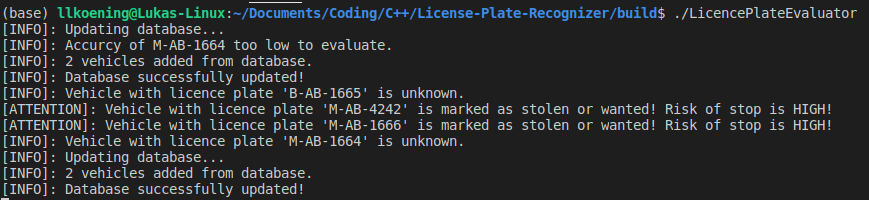

# German Licence Plate Evaluator

The GLPE (German Licence Plate Evaluator) was created during the [Udacity's C++ Nanodegree Program](https://www.udacity.com/course/c-plus-plus-nanodegree--nd213) as the Capstone project. The purpose of this evaluator is to classify licence plates detected by police car cameras and inform the police officers, that a licence plate is marked as stolen or wanted. This system is used in Great Britain combined with traffic cameras which also have a licence plate detection and evaluation.

Since vehicle can drive really fast in Germany, a fast evaluation is critical. Thus the GLPE uses concurrency for better performance.



Example output of the main.cpp file

## Project Overview

### Goals:

* Implement a program with the knowledge from the whole C++ Nanodegree
* Satisfy at least 5 criteria from the rubric.

### Structure:

The project is divided into different files. All header files can be found in the `include` folder.

* `src/licence_plate/LicencePlate.cpp` (and header file): Parent class for licence plate detection and licence plate database entry
* `src/licence_plate/LP_Detection.cpp` (and header file): Class for the licence plate detections from a recognition algorithm
* `src/licence_plate/LP_Entry.cpp` (and header file): Class for the licence plate database entry
* `src/licence_plate/LP_EvalResult.cpp` (and header file): Class (and enum) for the result from the evaluation
* `src/LP_Evaluator.cpp` (and header file): Class for the evaluator including concurrency
* `src/main.cpp` (and header file): Example usage
* other helper, build and installation files

### Dependencies

* cmake >= 3.7
* make >= 4.1 (Linux, Mac), 3.81 (Windows)
* gcc/g++ >= 5.4

### Basic Build and Run Instructions

1. Clone this repository.
2. Install dependencies.
3. Make a build directory in the top level directory: `mkdir build && cd build`
4. Compile: `cmake .. && make`
5. Run it: `./LicencePlateEvaluator`.


## Rubric Point Documentation

Here I will describe which [rubric points](https://review.udacity.com/#!/rubrics/2533/view) from Udacity's rubric and how I addressed.

**1.) The project demonstrates an understanding of C++ functions and control structures.**

There is usage of different control structures e.g. IF-Statement (`LP_Evaluator.cpp` lines 75-80), WHILE-Loops (`LP_Evaluator.cpp` lines 82-115) and SWITCH-Statement (`LP_Evaluator.cpp` lines 173-188). Due to object orientated programming the code is naturally divided into functions.

**2.) The project reads data from a file and process the data, or the program writes data to a file.**

The evaluator loads the database of licence plates from .txt files. This can be found in `LP_Evaluator.cpp` lines 50-115.

**3.) The project uses Object Oriented Programming techniques.**

The GLPE consists of multiple classes e.g. MessageQueue, LicencePlateEvaluator ( `LP_Evaluator.cpp`) and LicencePlate (`LicencePlate.cpp`).

**4.) Classes use appropriate access specifiers for class members.**

An example can be found in the `LP_EvalResult.h` file:

```c++
class LicencePlateEvaluationResult {
    public:
        // Constructor
        LicencePlateEvaluationResult(LicencePlateDetection detect, LicencePlateState st);

        // Getter and setter functions
        LicencePlateDetection getDetection();
        LicencePlateState getState();
        void setState(LicencePlateState state);

    private:
        // Variables
        LicencePlateDetection _detection;
        LicencePlateState _state; 
};
```

**5.) Class constructors utilize member initialization lists.**

Initialization lists are used in multiple files, for example in `LP_EvalResult.h`:

```c++
// Constructor
LicencePlateEvaluationResult::LicencePlateEvaluationResult(LicencePlateDetection detect, LicencePlateState st) : _detection(detect), _state(st) { }
```


#### Beside these five rubric points, there are more points fulfilled. Especially all four from the Currency section:

**The project uses multithreading. / A promise and future is used in the project. / A mutex or lock is used in the project. / A condition variable is used in the project.**

To increase performance dramatically, each evaluation task and database update is performed in it's own thread. For this purpose a message queue is used for the evaluation results. A message queue uses futures when adding new messages `LP_Evaluator.cpp` (lines 147-148):

```c++
auto f_queue = std::async(std::launch::async, &MessageQueue<LicencePlateEvaluationResult>::send, _results, std::move(result));
f_queue.wait();
```

Besides that the message queue uses a condition variable to synchronize receive and send and prevent useless receive requests. 

```c++
/* MessageQueue Definitions */

template<typename T> T MessageQueue<T>::receive() {
    // Protect work by a unique lock
    std::unique_lock<std::mutex> unique_lock(_mutex);

    // Wait until message is available
    _cond.wait(unique_lock, [this] { return !_queue.empty(); });

    // Return message (using move semantics)
    auto msg = std::move(_queue.back());
    _queue.erase(_queue.end());
    return msg;
}

template<typename T> void MessageQueue<T>::send(T &&msg) {
    // Protect work by a lock guard
    std::lock_guard<std::mutex> lock(_mutex);

    // Add message to queue
    _queue.push_back(std::move(msg));

    // Notify condition variable
    _cond.notify_one();
}
```

Mutexes are used to protect the database operations, message queue operations and the output to prevent mixed console outputs and data races.